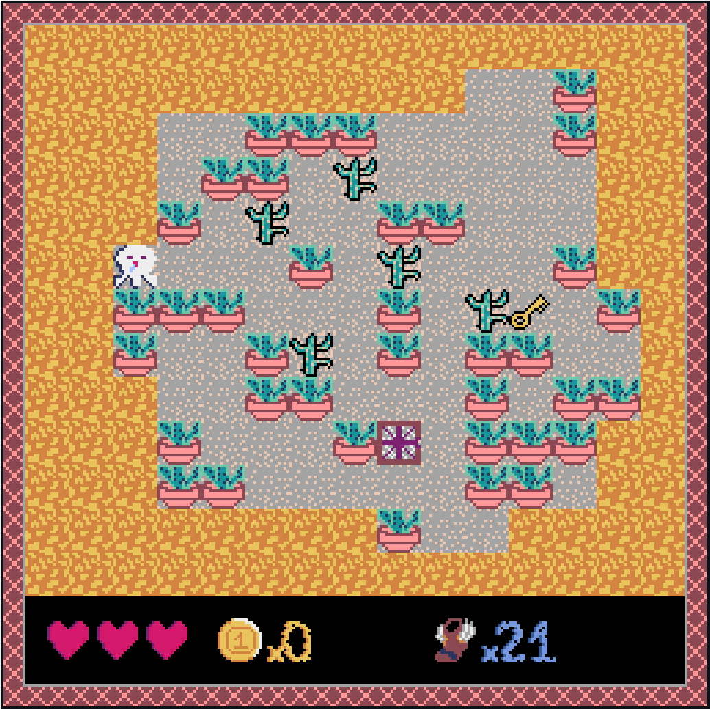
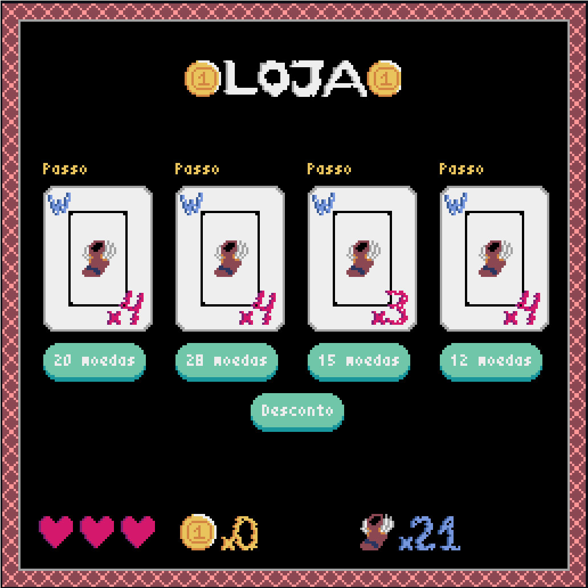
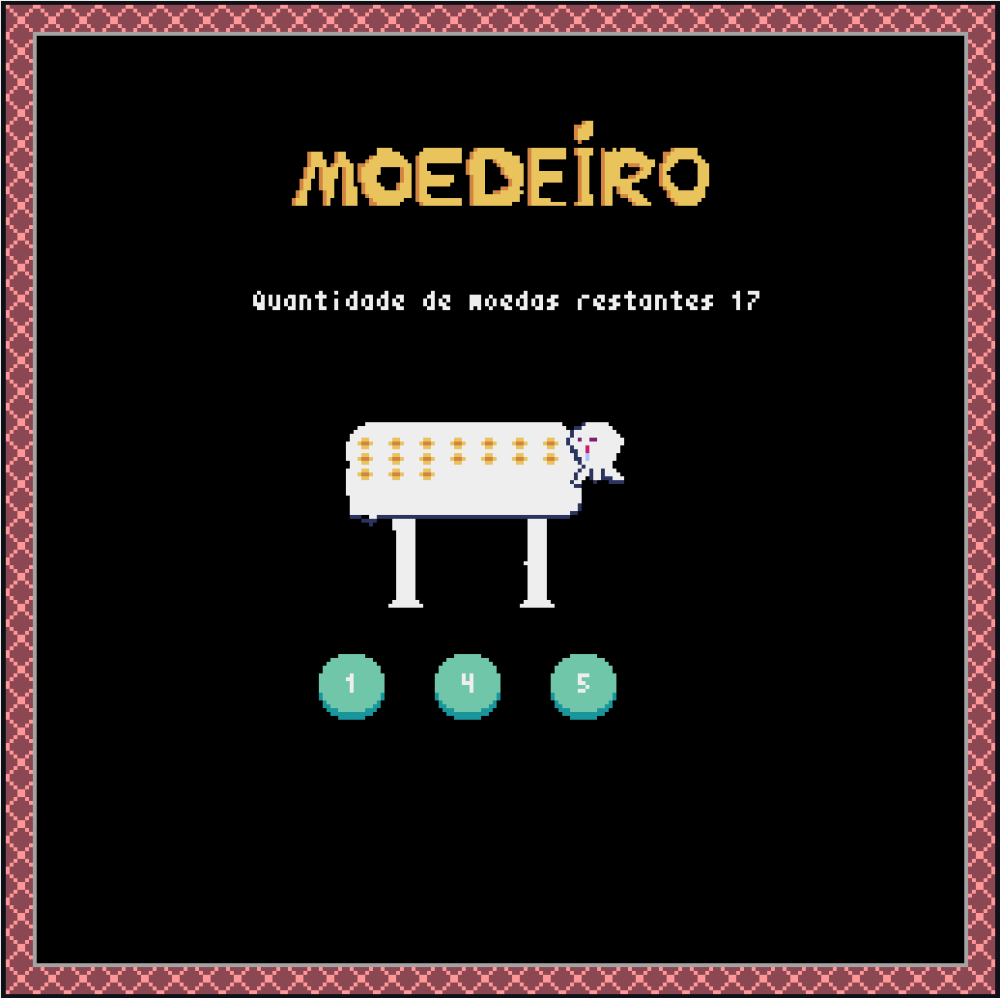

<!-- Adicionar Foto da logo aqui Deivid -->
# Waitheri

**Número da Lista**: X<br>
**Conteúdo da Disciplina**: Final<br>

## Vídeo de Apresentação
- https://1drv.ms/v/s!AheDTBV9xU0ahiJJaEBGvujbGerw?e=0vXP94

## Alunos
|Matrícula | Aluno |
| -- | -- |
| 19/0026758 |  Deivid Alves de Carvalho  |
| 19/0030879 |  João Pedro Moura Oliveira |

## Sobre 
Bem vindo ao jogo Waitheri, o fantasma babão. Infelizmente Waitheri está passando por um problema, ele está perdendo suas características de fantasma e não consegue atravessar as coisas. Então ele precisa de sua ajuda para pegar a chave e conseguir sair da sala através do alçapão. CUIDADO! Você não deve atravessar espinhos e também não deve utilizar mais passos que o necessário, pois irá perder sua vida.

Durante o jogo são utilizadas 4 técnicas que foram abordadas durante a disciplina. Grafos, Busca em grafos por Dijkstra (Grafos 2), Programação Dinâmica e Dividir e Conquistar com o quickselect.

- Grafos: Para o controle posicional do mapa, onde através de uma matriz que armazena dados sobre o peso do nó e se ele já foi visitado, é possível o acesso em O(1);
- Programação Dinâmica: Para dar um sentido ao jogo apresentado no desconto da loja. Nele é utiliza-se um algorótimo O(n) já apresentado pela equipe em [O Último Moedeiro](https://github.com/projeto-de-algoritmos/PD_O-ultimo-moedeiro);
- Dividir e Conquistar: Utilização do algorítmo de Quickselect, que possui uma complexidade O(n) no melhor caso, para busca de salas específicas com o intuito de gerar itens e o personagem principal. Sua utilização se faz presente também na geração da sala final (explicação detalhada no vídeo);
- Dijkstra: Para definir a quantidade de passos de cada sala, calculando o melhor caminho do personagem principal até a chave e depois da chave até o alçapão.

## Screenshots
### Gameplay


### Menu


### Tela do jogo


### Loja


### Tela do moedeiro


## Instalação 
**Linguagem**: python<br>
**Framework**: pyxel<br>

### Pré-requisitos
```
# Instalação do Pyxel
pip install pyxel

# Clonagem do repositório
git@github.com:projeto-de-algoritmos/Final_Waitheri.git

# Entre na pasta
cd Final_Waitheri
```

## Uso 
- Após a instalação dos pré-requisitos é necessário rodar o seguinte comando:
```
python src/app.py
```

# Customização e Configuração
- Muitas funções do projeto Waitheri foram feitas pensando em possíveis customizações, por esse motivo o arquivo `utils.py` contem uma série de variáveis que podem ser alteradas de forma a alterar a geração, loja, probabilidades e dinâmicas do jogo.
- Dentro do próprio arquivo existem comentários que norteiam as configurações, porém algumas serão melhor explicadas nessa seção:

- [Não Recomendado] Por traz do jogo existe uma matriz que controla várias informações. O seu tamanho pode ser alterado pelas seguintes variáveis:
```python
COLUMS = 15
ROWS = 13
```
</br>

- Dentro da geração das salas pequenos quartos são pré-criados de maneira a dar forma ao quarto final. Seus tamanhos (largura e espessura) máximos e mínimos podem ser alterados pelas seguintes variáveis:
```python
MAX_WIDTH_ROOM = 2
MAX_HEIGHT_ROOM = 2
MIN_WIDTH_ROOM = 2
MIN_HEIGHT_ROOM = 2
```
</br>

- Ainda em relação a pré-criação dos quartos é possível alterar a quantidade de salas geradas através da seguinte variável
```python
QTD_ROOMS = 8
```
</br>

- [Recomendado] Na geração dos pesos de cada quarto, é possível setar diferentes valores. Para isso deve-se utilizar as variáveis abaixo seguindo o formato esperado: (porcentagem desejada, valor na matriz)

- <b>ps.: Apenas as porcentagens de WALL e SPIKE devem ser alteradas, pois o cálculo é feito da seguinte forma: SPIKE <= valor, valor >= WALL > PER\_SPIKE e valor >= FLOOR > PER\_WALL.</b>
```python
PER_FLOOR = (100, 1)
PER_WALL = (49, 2)
PER_SPIKE = (7, 3)
```
</br>

- [Recomendado] Ao quebrar uma caixa existe a probabilidade de ser dropada uma moeda. Esse valor é setado na seguinte variável:
```python
PER_COIN = 30
```
</br>

- [Recomendado] Ao finalizar uma sala o jogador pode ser recompensado com uma quantidade aleatória de moedas. Esses possíveis valores podem ser alterados na seguinte variável:
```python
COINS_PER_ROOM = [1, 4, 7, 10]
```
</br>

- [Não Recomendado] Em toda loja uma quantidade de itens é mostrada ao jogador, sendo essa quantidade possível de ser alterada na seguinte variável:
```python
AMOUNT_ITENS_STORE = 4
```
</br>

- [Recomendado] Uma lógica possível de alteração é a possibilidade de abrir a loja mais de uma vez por sala. A variável que controla isso é a seguinte:
```python
ONE_STORE_PER_ROOM = False
```
</br>

- [Recomendado, Atenção] Toda loja possui uma lista única de itens que é gerada por sala. Os possíveis itens que podem aparecer na loja é controlada pela variável abaixo. Essa variável é um dicionário, em que as chaves indicam o nome que aparecerá na loja. Para cada item no dicionário deve-se seguir o seguinte formato: (probabilidade do item aparecer na loja, [possíveis quantidades], (preço mínimo, preço máximo))
```python
STORE_ITENS = {
    "Coracao": (
        30,
        [1, 2],
        (5, 7)
    ),
    "Passo": (
        100,
        [2, 3, 4],
        (3, 7)
    )
}
```
</br>

- [Recomendado, Atenção] Ao se pedir um desconto na loja o jogo do moedeiro é ativo e alguns parâmetros são passados. Essas definições de possíveis jogos são descritas na seguinde variável, que deve seguir o seguinte padrão: [(desconto caso vitória, aumento caso derrota), (quantidade de moedas do jogo, quantidade de retirada 1, quantidade de retirada 2)]
```python
DISCOUNTS = [
    ((2, 1), (14, 2, 5)),
    ((3, 2), (10, 3, 4)),
    ((4, 3), (15, 3, 6)),
    ((5, 4), (17, 4, 5))
]
```
